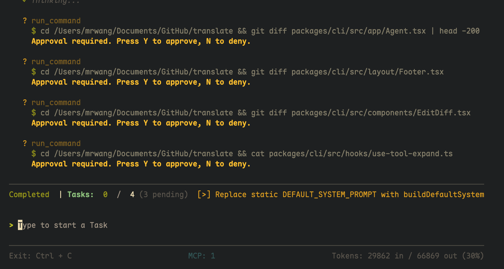
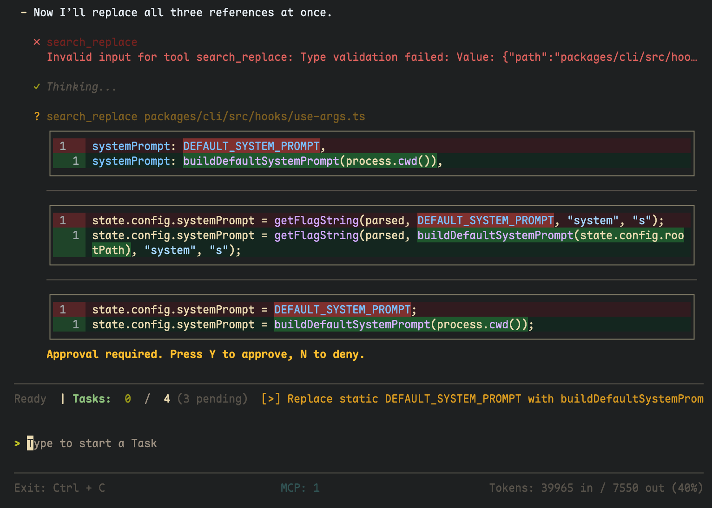
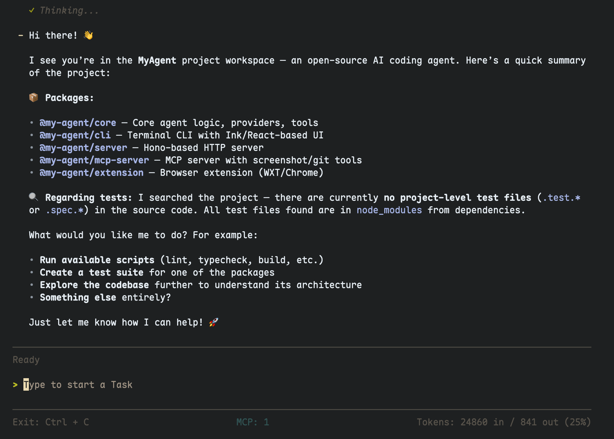
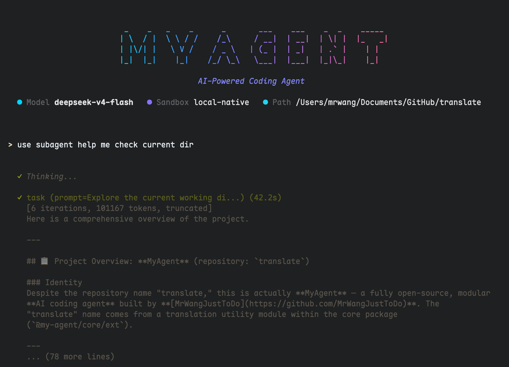

# MyAgent

[](LICENSE)
[](https://nodejs.org)
[](https://pnpm.io)
[](https://sdk.vercel.ai/docs)

An open-source AI coding agent built on [Vercel AI SDK](https://sdk.vercel.ai/docs) with a React-powered terminal UI and Chrome extension.

---

## Features

| Category | Description |
|----------|-------------|
| **Multi-Model** | OpenAI, Ollama, DeepSeek, OpenRouter — any LLM provider |
| **Terminal UI** | React-powered with Shiki syntax highlighting, diff views, streaming markdown |
| **Chrome Extension** | Full agent UI running in the browser via remote CoreEnv |
| **Local / Remote** | Run tools locally or proxy through an HTTP server — seamless switching |
| **Tool Approval** | Review + approve/deny tool calls with custom deny reasons |
| **Ask User** | Agent asks questions with selectable options or freeform answers |
| **Subagents** | Context-isolated tasks with read-only tools and 30-step limit |
| **Skills** | On-demand domain knowledge injection (list → load) |
| **Context Compaction** | 2-layer compression for infinite conversations |
| **Session Persistence** | Save/resume conversations to disk |
| **Sandbox** | Isolated command execution with OS-level sandboxing |
| **Web** | DuckDuckGo search + page fetch |
| **MCP** | Connect to MCP servers for extra tools |
| **Memory** | Automatic extraction and consolidation |

---

## Architecture

```
┌──────────────────────────────────────────────────────────┐
│  Runtime Hosts                                           │
│  ┌────────────────┐        ┌───────────────────────┐     │
│  │  @my-agent/cli │        │  @my-agent/extension  │     │
│  │  (Terminal)     │        │  (Chrome Extension)   │     │
│  └───────┬────────┘        └──────────┬────────────┘     │
│          └──────┐  AgentAdapter  ┌────┘                  │
│          ┌──────┴────────────────┴──────┐                │
│          │  @my-agent/app (shared UI)   │                │
│          └──────────────┬───────────────┘                │
│                         │                                │
│          ┌──────────────┴───────────────┐                │
│          │  @my-agent/core              │                │
│          │  (Agent, Tools, Models, MCP) │                │
│          └──────────────┬───────────────┘                │
│                         │ CoreEnv                        │
│          ┌──────────────┴───────────────┐                │
│          │  CoreEnv Adapter Layer       │                │
│          │  ┌───────────┐ ┌───────────┐ │                │
│          │  │ @my-agent │ │ @my-agent │ │                │
│          │  │ /node     │ │ /server   │ │                │
│          │  │ (local)   │ │ (remote)  │ │                │
│          │  └───────────┘ └─────┬─────┘ │                │
│          └──────────────────────┼───────┘                │
│                                 │ Hono RPC               │
│          ┌──────────────────────┴───────┐                │
│          │  @my-agent/server (HTTP)     │                │
│          │  (uses @my-agent/node)       │                │
│          └──────────────────────────────┘                │
└──────────────────────────────────────────────────────────┘
```

| Package | Description |
|---------|-------------|
| `@my-agent/core` | Runtime-agnostic core: agent loop, 22 tools, LLM model factory, sessions, MCP, skills, memory |
| `@my-agent/app` | Shared UI layer: React components, hooks, commands, AgentAdapter interface |
| `@my-agent/cli` | Terminal host using [@my-react/react-terminal](https://github.com/MrWangJustToDo/MyReact) |
| `@my-agent/node` | Node.js CoreEnv: native filesystem, shell execution, OS sandbox |
| `@my-agent/server` | CoreEnv HTTP server (Hono RPC) + type-safe remote client |
| `@my-agent/extension` | Chrome extension host (WXT + HeroUI) |
| `@my-agent/mcp-server` | MCP server with screenshot tool |

### CoreEnv — Runtime Abstraction

`CoreEnv` is the central interface that decouples the agent from any specific runtime. All filesystem, shell, fetch, and platform APIs go through it.

- **Local mode** — `@my-agent/node` provides a `CoreEnv` backed by Node.js APIs with optional OS sandbox
- **Remote mode** — `@my-agent/server` runs an HTTP server exposing CoreEnv via Hono RPC; the client (`createRemoteCoreEnv`) proxies all calls over HTTP

The CLI can switch between modes with `--remote <url>`. The extension always uses remote mode.

| Combination | CoreEnv | Host | Status |
|------------|---------|------|--------|
| Local + CLI | `createNodeEnv` | Terminal | Fully working |
| Remote + CLI | `createRemoteCoreEnv` | Terminal | Working |
| Remote + Extension | `createRemoteCoreEnv` | Chrome | Working |

---

## Screenshots

### Tool Flow


### Edit with Diff View


### Markdown Rendering


### Subagent


### Web Tools


### Devtools Debug
Built with [myreact-devtools](https://github.com/MrWangJustToDo/myreact-devtools) powered by [@my-react framework](https://github.com/MrWangJustToDo/MyReact)


---

## Quick Start

### Prerequisites
- Node.js 22+, pnpm 9+

```bash
git clone https://github.com/MrWangJustToDo/MyAgent.git
cd MyAgent
pnpm install
pnpm build
```

### Configuration

Create `.env` in the root:

```bash
PROVIDER=ollama            # ollama | openai | deepseek | openRouter | openaiCompatible
MODEL=qwen3:8b
API_URL=http://localhost:11434
API_KEY=sk-xxx             # Required for non-Ollama providers
SANDBOX_ENV=local          # local (OS sandbox) | native (no sandbox)
MAX_ITERATIONS=50
```

### Running

```bash
# Terminal CLI (local mode)
pnpm start:cli

# Terminal CLI (remote mode — connect to a running server)
pnpm start:cli -- --remote http://localhost:3100

# CoreEnv HTTP server (required for extension and remote CLI)
pnpm start:server

# Browser extension dev server
pnpm dev:extension

# MCP server
pnpm start:mcp-server
```

### CLI Usage

```bash
# Start with a prompt
pnpm start:cli -- "Explain this codebase"

# Continue last session
pnpm start:cli -- --continue

# Use a specific model
pnpm start:cli -- --model gpt-4o --provider openai --api-key sk-xxx
```

---

## Tools

| Category | Tools |
|----------|-------|
| **File** | `read_file`, `write_file`, `edit_file`, `copy_file`, `move_file`, `delete_file`, `glob`, `grep`, `tree`, `list_file` |
| **System** | `run_command` |
| **Web** | `websearch` (DuckDuckGo), `webfetch` (page fetch) |
| **Agent** | `task` (subagents), `ask_user` (questions with multi-select), `todo` (task lists), `list_skills`, `load_skill` |

---

## CLI Keyboard Shortcuts

The CLI has **4 input modes** — shortcuts adapt to the current mode:

| Key | Normal | Approval | Select (Ask User) | Freeform |
|-----|--------|----------|-------------------|----------|
| `Enter` | Submit | Submit command | Confirm selection | Submit |
| `Esc` | Dismiss autocomplete / Abort | Cancel deny reason | Close list | Go back |
| `y` / `n` | — | Approve / Deny | — | — |
| `↑` `↓` | History / Autocomplete | Autocomplete nav | Navigate options | — |
| `Space` | — | — | Toggle (multi-select) | — |
| `Tab` | Accept autocomplete | Accept autocomplete | — | — |
| `Ctrl+V` | Paste image | — | — | — |
| `Ctrl+C` | Exit | Exit | Exit | Exit |

Slash commands: `/help`, `/compact`, `/clear`, `/rename`, `/resume`, `/mcp`, `/usage`, `/quit`

---

## Development

```bash
pnpm dev          # Watch all packages
pnpm typecheck    # TypeScript check
pnpm lint         # ESLint
pnpm format       # Prettier
pnpm build        # Production build (core → app → rest)
pnpm clean        # Remove build artifacts
```

### Build Order

`@my-agent/core` must build before `@my-agent/app`, which must build before `cli`, `server`, and `extension`. The root `pnpm build` script handles this automatically.

---

## License

MIT © [MrWangJustToDo](https://github.com/MrWangJustToDo)

Built with [@my-react framework](https://github.com/MrWangJustToDo/MyReact), [Vercel AI SDK](https://sdk.vercel.ai/docs), and [Ollama](https://ollama.ai)
