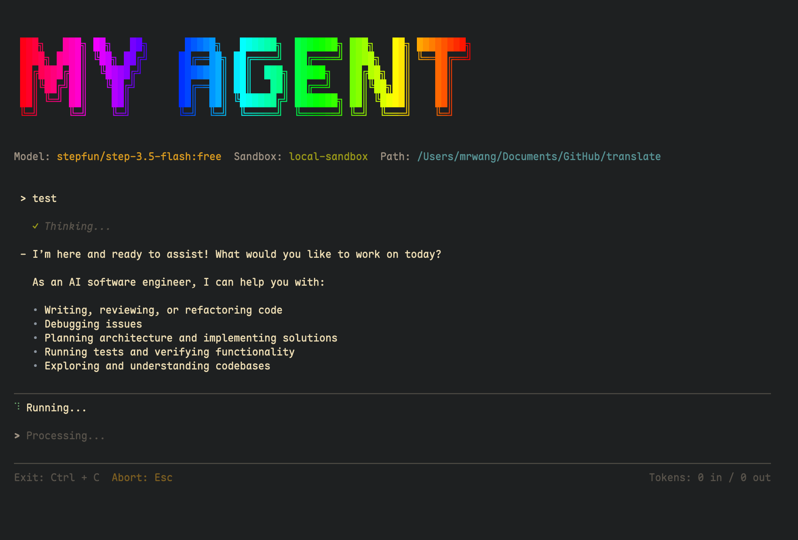
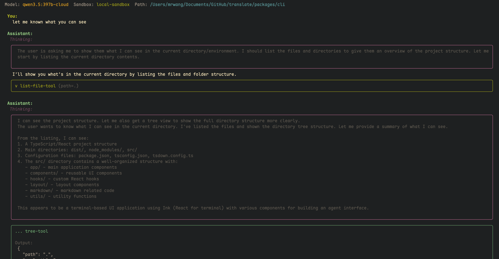

# My Agent

An AI coding agent built on [Vercel AI SDK](https://sdk.vercel.ai/docs) with a beautiful terminal interface.



## Features

- **Multi-Model Support** - Works with OpenAI, Ollama, and other providers via Vercel AI SDK
- **Terminal UI** - Beautiful React-based terminal interface using Ink
- **Tool Approval** - Interactive approval flow for sensitive operations
- **Subagent System** - Delegate complex tasks to context-isolated subagents
- **Skill System** - On-demand domain knowledge loading
- **Context Compaction** - Infinite sessions with three-layer compression
- **Sandbox Execution** - Isolated command execution environment

## Screenshots

### Tool Approval Flow


### Web Search & Fetch


### Codebase Exploration


## Architecture

This is a pnpm monorepo with three packages:

| Package | Description |
|---------|-------------|
| `@my-agent/core` | Core AI agent, tools, environment abstraction, and Vercel AI SDK integration |
| `@my-agent/cli` | Terminal CLI using Ink (React for terminal) |
| `@my-agent/extension` | Browser extension using WXT framework |

## Quick Start

### Prerequisites

- Node.js 18+
- pnpm 8+

### Installation

```bash
# Clone the repository
git clone https://github.com/MrWangJustToDo/MyAgent.git
cd MyAgent

# Install dependencies
pnpm install

# Build all packages
pnpm build
```

### Configuration

Create a `.env` file in the root directory:

```bash
# OpenAI API Key (for OpenAI models)
OPENAI_API_KEY=sk-xxx

# Or use Ollama (local models)
OLLAMA_BASE_URL=http://localhost:11434

# Sandbox environment: local | native | remote
SANDBOX_ENV=local
```

### Running the CLI

```bash
# Start the CLI
pnpm start:cli

# Or run in development mode
pnpm dev:cli
```

## Available Tools

The agent comes with a comprehensive set of tools:

### File Operations
- `read_file` - Read file contents with line numbers
- `write_file` - Write content to files
- `edit_file` - Make precise edits to files
- `glob` - Find files by pattern
- `grep` - Search file contents
- `tree` - Display directory structure

### System Operations
- `run_command` - Execute shell commands
- `list_file` - List directory contents

### Web Operations
- `websearch` - Search the web using Google
- `webfetch` - Fetch and parse web pages

### Agent Operations
- `task` - Delegate tasks to subagents
- `todo` - Manage task lists
- `compact` - Manually compress conversation context
- `list_skills` / `load_skill` - Load domain-specific knowledge

## Development

```bash
# Run all packages in watch mode
pnpm dev

# Type check
pnpm typecheck

# Lint and format
pnpm lint
pnpm format

# Build specific packages
pnpm build:core
pnpm build:cli
pnpm build:extension
```

## Key Technologies

- **[Vercel AI SDK](https://sdk.vercel.ai)** - AI SDK for LLM interactions
- **[Ink](https://github.com/vadimdemedes/ink)** - React for terminal UIs
- **[Zod](https://zod.dev)** - Schema validation
- **[WXT](https://wxt.dev)** - Browser extension framework

## Keyboard Shortcuts

| Key | When Running | When Idle |
|-----|--------------|-----------|
| `Esc` | Abort current run | Exit app |
| `Ctrl+C` | Exit app | Exit app |
| `Y` | Approve tool | - |
| `N` | Deny tool | - |

## Contributing

Contributions are welcome! Please read the [AGENTS.md](AGENTS.md) file first to understand the coding conventions and architectural patterns.

1. Fork the repository
2. Create a feature branch
3. Make your changes
4. Ensure tests pass and code is formatted
5. Submit a pull request

## License

MIT

---

Built with [Vercel AI SDK](https://sdk.vercel.ai/docs) and [Ollama](https://ollama.ai)
