# MyAgent

[](LICENSE)
[](https://nodejs.org)
[](https://pnpm.io)
[](https://tanstack.com/ai)

An open-source AI coding agent built on [TanStack AI SDK](https://tanstack.com/ai) with a React-powered terminal UI and Chrome extension.

Designed with a runtime-agnostic core that decouples agent logic from execution environment — run tools locally, proxy through an HTTP server, or embed in a browser extension.

---

## Features

| Category | Description |
|----------|-------------|
| **Multi-Model** | OpenAI, Anthropic, DeepSeek, Ollama, OpenRouter — any LLM provider via model adapter |
| **Terminal UI** | React-powered TUI with Shiki syntax highlighting, scrollable diff views, streaming markdown, and theme support |
| **Workspace Browser** | Full-screen file tree (`Ctrl+E`) with git status, Seti/Nerd Font icons, scrollable file preview, and HEAD diff view |
| **Chrome Extension** | Full agent UI running in the browser via remote CoreEnv (WXT + HeroUI) |
| **Local / Remote** | Run tools locally or proxy through an HTTP server — seamless switching via `--remote` |
| **Tool Approval** | Review + approve/deny tool calls; scrollable diffs with Tab to switch when multiple edits are pending |
| **Ask User** | Agent asks questions with selectable options or freeform answers |
| **Subagents** | Context-isolated read-only tasks with 30-step limit for parallel exploration |
| **Skills** | On-demand domain knowledge injection (list → load workflow) |
| **Context Compaction** | 3-layer compression (micro, reasoning stripping, auto) + reactive compaction on errors for infinite conversations |
| **Session Persistence** | Save/resume conversations to disk with auto-save |
| **Memory** | Automatic cross-session knowledge extraction and consolidation |
| **Event System** | Full lifecycle event bus with logging bridge |
| **Hooks System** | Pre-tool-use and post-tool-use script execution (permissions, transformations) |
| **Sandbox** | Isolated command execution with OS-level sandboxing (`@anthropic-ai/sandbox-runtime`) |
| **MCP Integration** | Connect to external MCP servers for additional tools |
| **Web** | DuckDuckGo search + page fetch |
| **Devtools** | Built-in [myreact-devtools](https://github.com/MrWangJustToDo/myreact-devtools) for debugging |

---

## Architecture

```
┌─────────────────────────────────────────────────────────────┐
│  Runtime Hosts                                              │
│  ┌──────────────────┐    ┌────────────────────────────┐     │
│  │  @my-agent/cli   │    │  @my-agent/extension       │     │
│  │  (Ink terminal)  │    │  (WXT Chrome extension)    │     │
│  └────────┬─────────┘    └─────────────┬──────────────┘     │
│           │      AgentAdapter           │                    │
│  ┌────────┴────────────────────────────┴──────────────┐     │
│  │  @my-agent/app  (shared UI, hooks, commands)       │     │
│  └────────────────────────┬───────────────────────────┘     │
│                           │  AgentManager / Tools           │
│  ┌────────────────────────┴───────────────────────────┐     │
│  │  @my-agent/core  (agent loop, tools, models, MCP)  │     │
│  └────────────────────────┬───────────────────────────┘     │
│                           │  CoreEnv interface               │
│  ┌────────────────────────┴───────────────────────────┐     │
│  │  CoreEnv Adapter Layer                              │     │
│  │  ┌──────────────────┐  ┌────────────────────────┐  │     │
│  │  │ @my-agent/node   │  │ @my-agent/server       │  │     │
│  │  │ (local Node.js)  │  │ (remote HTTP client)   │  │     │
│  │  └──────────────────┘  └───────────┬────────────┘  │     │
│  └────────────────────────────────────┼───────────────┘     │
│                                       │ Hono RPC            │
│  ┌────────────────────────────────────┴───────────────┐     │
│  │  @my-agent/server (HTTP server, uses node)         │     │
│  └────────────────────────────────────────────────────┘     │
└─────────────────────────────────────────────────────────────┘
```

### CoreEnv — Runtime Abstraction

`CoreEnv` is the central interface that decouples `@my-agent/core` from any specific runtime. All filesystem, shell, fetch, and platform APIs go through it — making the core truly runtime-agnostic.

| Implementation | Package | Use Case |
|:--------------|:--------|:---------|
| `createNodeEnv()` | `@my-agent/node` | Local mode — backed by Node.js APIs with optional OS sandbox |
| `createRemoteCoreEnv(url)` | `@my-agent/server` (client) | Remote mode — proxies all calls over Hono RPC to a server |

| Combination | CoreEnv | Host | Status |
|------------|---------|------|--------|
| Local + CLI | `createNodeEnv` | Terminal | Fully working |
| Remote + CLI | `createRemoteCoreEnv` | Terminal | Working |
| Remote + Extension | `createRemoteCoreEnv` | Chrome | Working |

### Package Overview

| Package | Description |
|---------|-------------|
| `@my-agent/core` | Runtime-agnostic core: `ManagedAgent` runtime, 18 tools, LLM model factory, sessions, MCP, skills, memory, compaction, event bus |
| `@my-agent/app` | Shared UI layer: React components, hooks, commands, `AgentAdapter` interface, theming |
| `@my-agent/cli` | Terminal host using [@my-react/react-terminal](https://github.com/MrWangJustToDo/MyReact) |
| `@my-agent/node` | Node.js CoreEnv implementation: native filesystem, shell execution, OS sandbox |
| `@my-agent/server` | CoreEnv HTTP server (Hono RPC) + type-safe remote client factory |
| `@my-agent/extension` | Chrome extension host using WXT framework |
| `@my-agent/mcp-server` | Standalone MCP server for external tool integration |

> **Deep dive:** See [AGENTS.md](AGENTS.md) for full architecture, code conventions, and detailed guidelines. See [packages/core/ARCHITECTURE.md](packages/core/ARCHITECTURE.md) for the core runtime startup, initialization, session, memory, compaction, and approval flows.

---

## Screenshots

### Welcome Screen

Default and alternate theme on the idle screen. Header shortcuts: `/` commands, `Ctrl+E` workspace, `Ctrl+T` task panel, `Ctrl+V` paste image.

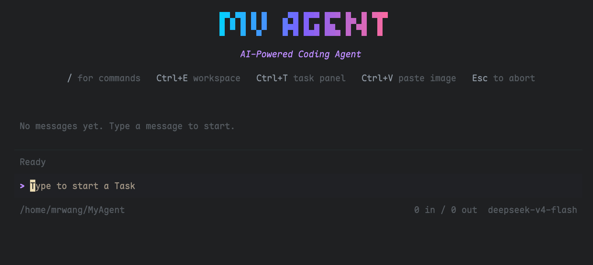
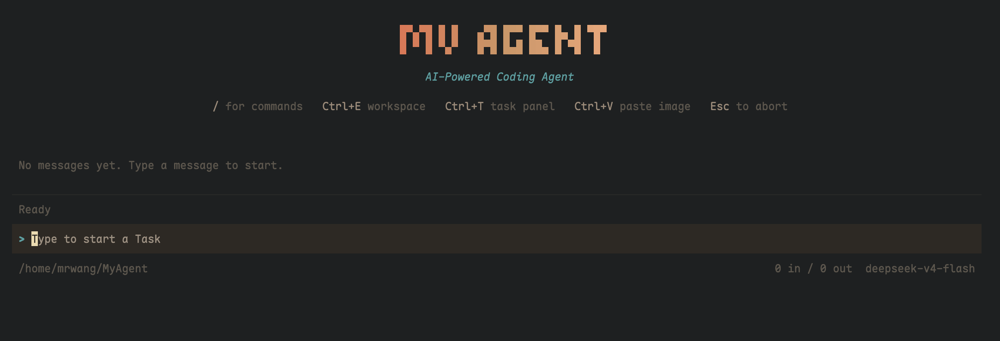

### Slash Commands

Type `/` to open the command palette with autocomplete (`/help`, `/compact`, `/resume`, `/usage`, …).

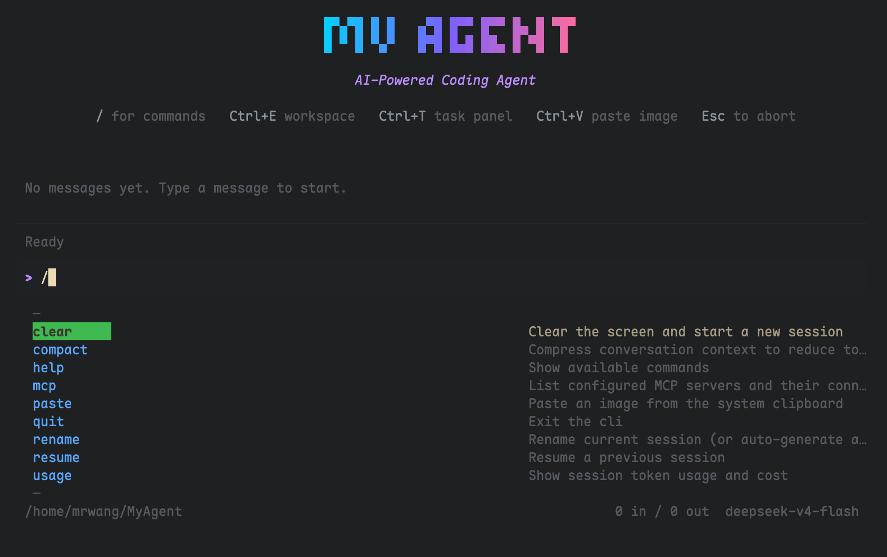

### Tool Flow & Approval

Agent tool calls with inline status, approval prompts (`y` / `n`), and token/cost tracking in the status bar.

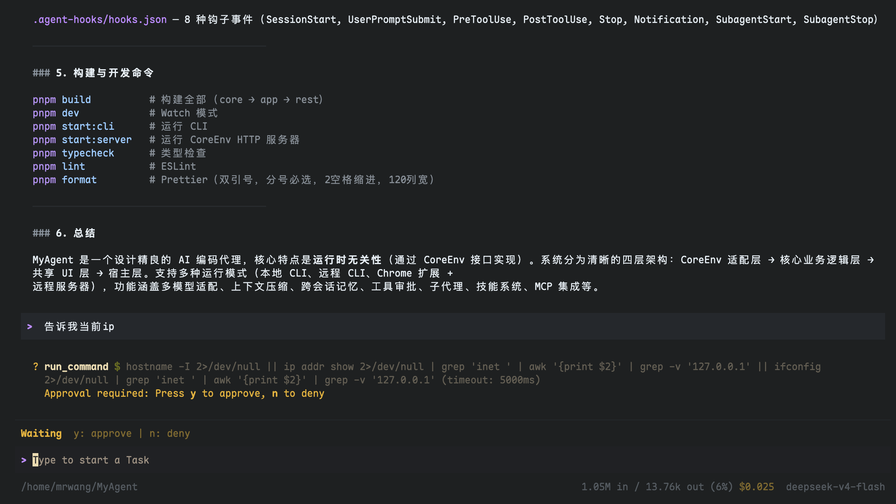

### Ask User

Interactive questions with arrow-key selection, multi-select toggles, and optional freeform answers.

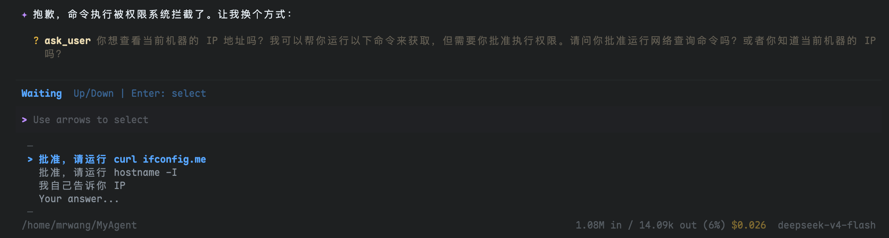

### Code Edits with Diff View

Side-by-side diff for `edit_file` / `write_file` tool previews. Long diffs use a scrollable viewport (`max(2/3 terminal height, 28 rows)`). When several diffs are pending, **Tab** switches focus and **↑↓** scrolls the selected diff; **y** / **n** apply to the focused one.

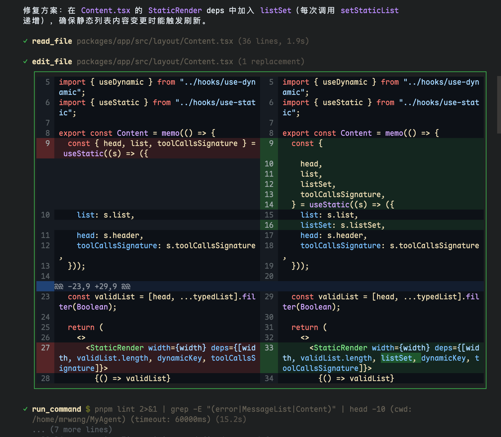

### Markdown Rendering

Streaming markdown with syntax-highlighted code blocks in the message stream.


### Task & Subagents

Spawn read-only subagents via the `task` tool. Open the task panel with `Ctrl+T` to inspect live runs and summaries.

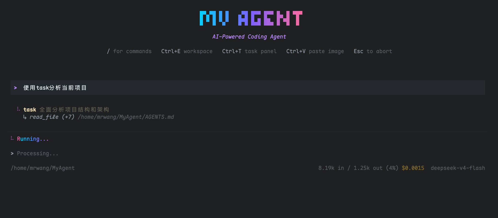
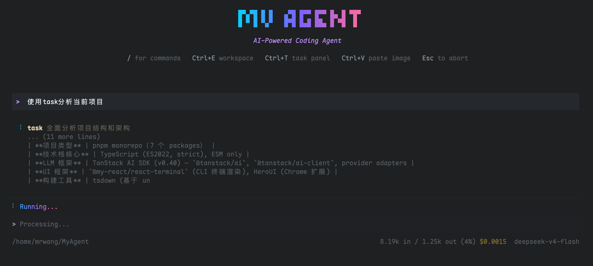
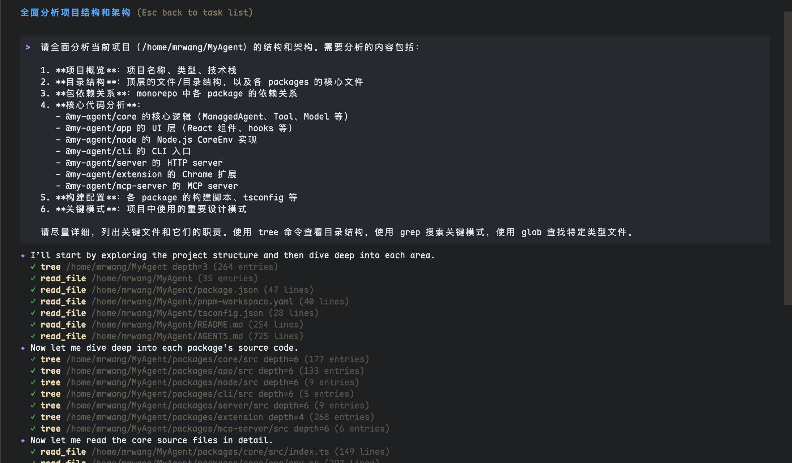

### Workspace Browser

Press `Ctrl+E` for a full-screen workspace panel: file tree with git status badges, scrollable **Preview** (`CodeView`), and **Diff vs HEAD** (`DiffView`). **Tab** toggles preview/diff; **←→** moves focus; **↑↓** scrolls; **R** refreshes.

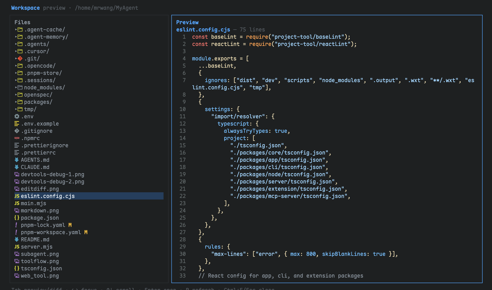
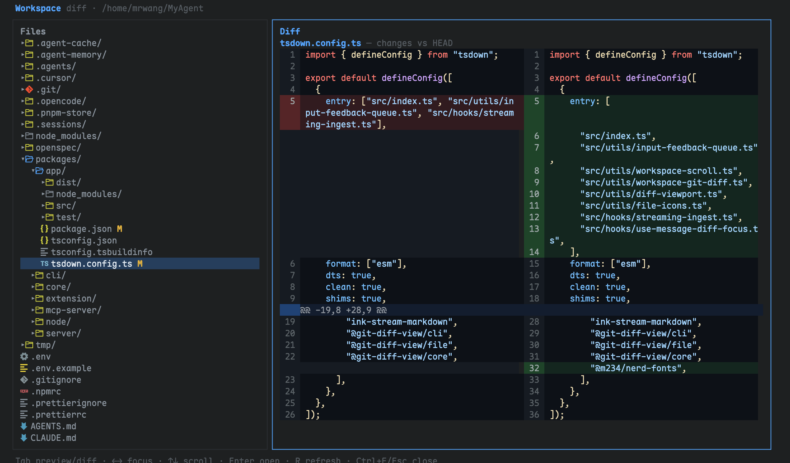

### Devtools Debug

Built with [myreact-devtools](https://github.com/MrWangJustToDo/myreact-devtools) powered by [@my-react framework](https://github.com/MrWangJustToDo/MyReact)


---

## Quick Start

### Prerequisites
- Node.js 22+, pnpm 9+

```bash
git clone https://github.com/MrWangJustToDo/MyAgent.git
cd MyAgent
pnpm install
pnpm build
```

### Configuration

Create `.env` in the root:

```bash
# Provider: openai | anthropic
MODEL_STYLE=openai
BASE_URL=https://api.deepseek.com
API_KEY=sk-your-key-here
MODEL=deepseek-v4-flash

# Sandbox: native (no sandbox) | local (OS sandbox)
SANDBOX_ENV=native

# Server port (for remote mode)
SERVER_PORT=3200
```

### Running

```bash
# Terminal CLI (local mode)
pnpm start:cli

# Start with a prompt
pnpm start:cli -- "Explain this codebase"

# Terminal CLI (remote mode — connect to a running server)
pnpm start:cli -- --remote http://localhost:3200

# Continue last session
pnpm start:cli -- --continue

# CoreEnv HTTP server (required for extension and remote CLI)
pnpm start:server

# Browser extension dev server
pnpm dev:extension

# MCP server
pnpm start:mcp-server
```

---

## Tools

| Category | Tools |
|----------|-------|
| **File** | `read_file`, `write_file`, `edit_file`, `copy_file`, `move_file`, `delete_file`, `glob`, `grep`, `tree`, `list_file` |
| **System** | `run_command` |
| **Web** | `websearch` (DuckDuckGo), `webfetch` (page fetch) |
| **Agent** | `task` (subagents), `ask_user` (questions with multi-select), `todo` (task lists), `list_skills`, `load_skill` |

---

---

## Workspace Browser

Open with **`Ctrl+E`** from the main CLI (toggle close with `Ctrl+E` or `Esc`).

| Key | Action |
|-----|--------|
| `←` `→` | Move focus between file tree and preview/diff pane |
| `↑` `↓` | Navigate tree, or scroll preview/diff when right pane is focused |
| `Enter` / `→` | Expand directory or open file for preview |
| `Tab` | Toggle **Preview** ↔ **Diff vs HEAD** |
| `R` | Refresh tree, git status, and file/diff caches |
| `Esc` | Close workspace |

The file tree shows git porcelain status (`M`, `?`, `D`, …), Seti/Nerd Font file icons (disable with `MY_AGENT_NERD_ICONS=0`), and chevron + folder icons for expanded/collapsed directories.

---

## CLI Keyboard Shortcuts

Global shortcuts (from the header):

| Key | Action |
|-----|--------|
| `/` | Open slash-command autocomplete |
| `Ctrl+E` | Toggle workspace browser |
| `Ctrl+T` | Open task / subagent panel |
| `Ctrl+V` | Paste image from clipboard |
| `Esc` | Abort run / dismiss panels (context-dependent) |

The CLI has **4 input modes** — shortcuts adapt to the current mode:

| Key | Normal | Approval | Select (Ask User) | Freeform |
|-----|--------|----------|-------------------|----------|
| `Enter` | Submit | Submit command | Confirm selection | Submit |
| `Esc` | Dismiss autocomplete / Abort | Cancel deny reason | Close list | Go back |
| `y` / `n` | — | Approve / Deny focused diff | — | — |
| `↑` `↓` | History / Autocomplete | Scroll focused diff / Autocomplete | Navigate options | — |
| `Space` | — | — | Toggle (multi-select) | — |
| `Tab` | Accept autocomplete | Switch focused diff (multi) / Accept autocomplete | — | — |
| `Ctrl+V` | Paste image | — | — | — |
| `Ctrl+C` | Exit | Exit | Exit | Exit |

Slash commands: `/help`, `/compact`, `/clear`, `/rename`, `/resume`, `/mcp`, `/usage`, `/quit`

---

## Development

```bash
pnpm dev          # Watch all packages
pnpm typecheck    # TypeScript check
pnpm lint         # ESLint
pnpm format       # Prettier
pnpm build        # Production build (core → app → rest)
pnpm clean        # Remove build artifacts
```

> **Note:** No test framework is configured. Use `pnpm typecheck` and `pnpm build` for validation.

### Build Order

`@my-agent/core` → `@my-agent/app` → `cli` / `server` / `extension`. Handled automatically by `pnpm build`.

### Code Style

- **ESM only** — all packages use `"type": "module"`. Use `.js` extensions in local imports.
- **Double quotes**, semicolons required, 2-space indent, 120 char line width
- **Zod v4** for all schemas
- **Workspace deps** use `workspace:*`

---

## Reference Documentation

| Document | Description |
|----------|-------------|
| [CLAUDE.md](CLAUDE.md) | Quick reference for AI coding agents working in this repo |
| [AGENTS.md](AGENTS.md) | Full architecture, code conventions, and detailed guidelines |
| [packages/core/ARCHITECTURE.md](packages/core/ARCHITECTURE.md) | Core runtime deep-dive: startup, initialization, session, memory, compaction, approval |

---

## License

MIT © [MrWangJustToDo](https://github.com/MrWangJustToDo)

Built with [@my-react framework](https://github.com/MrWangJustToDo/MyReact), [TanStack AI SDK](https://tanstack.com/ai), and [Ollama](https://ollama.ai)
