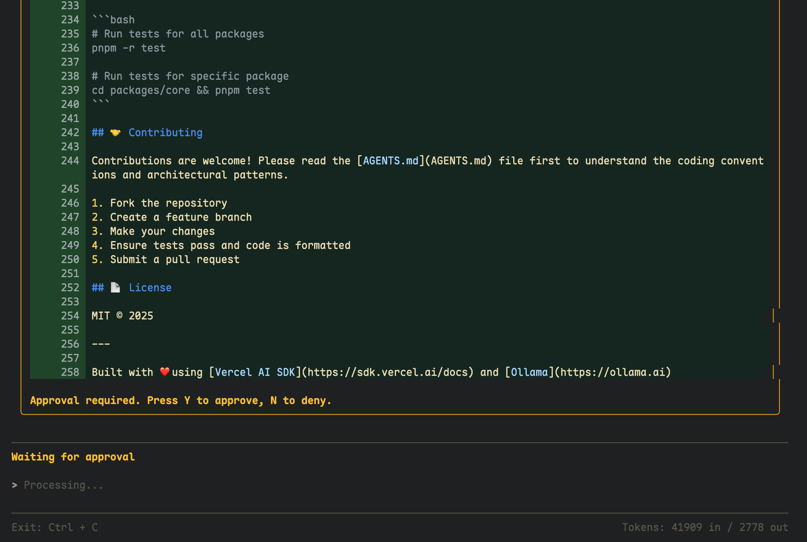
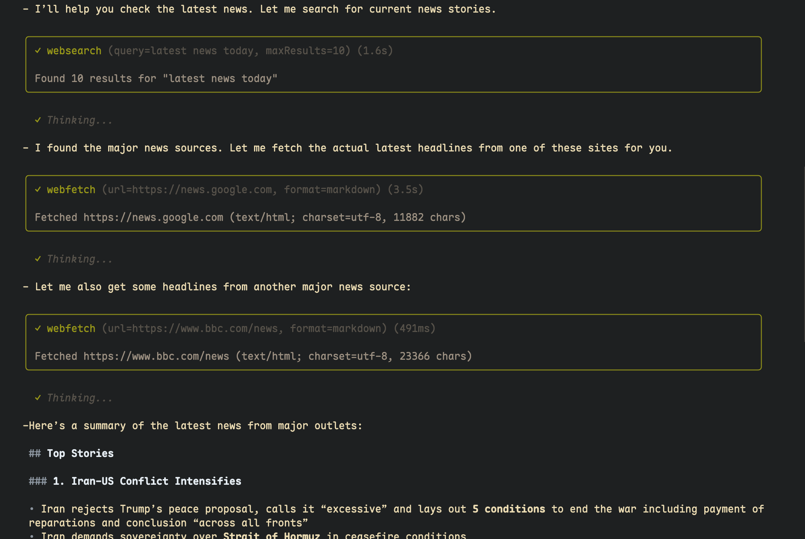
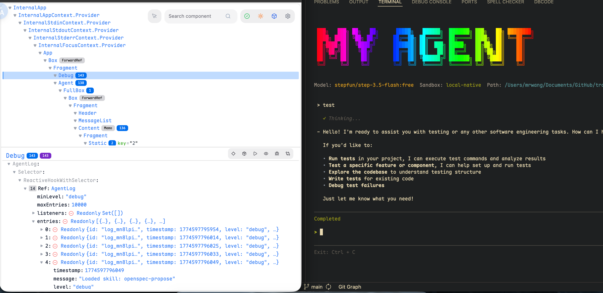
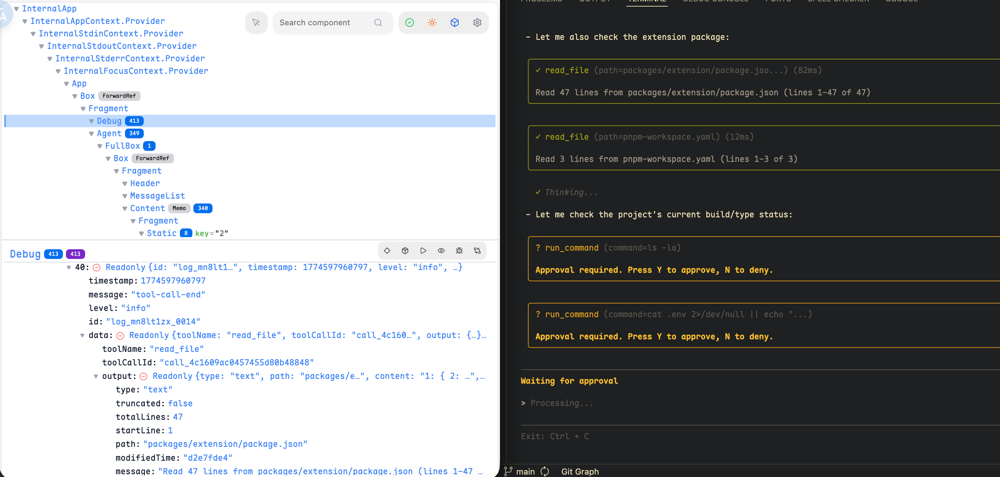
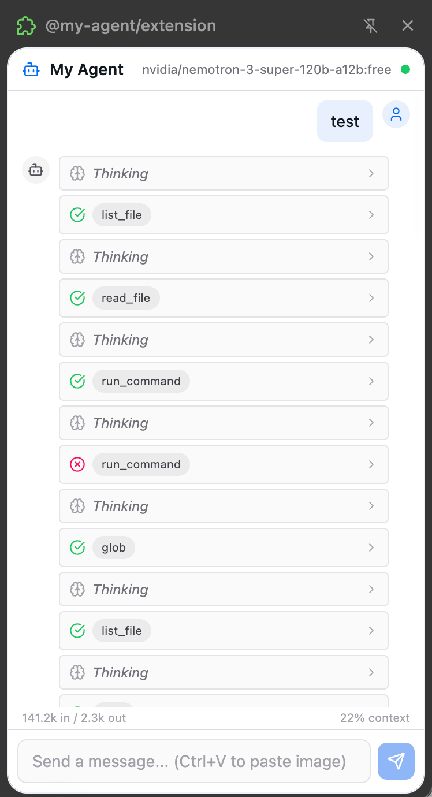
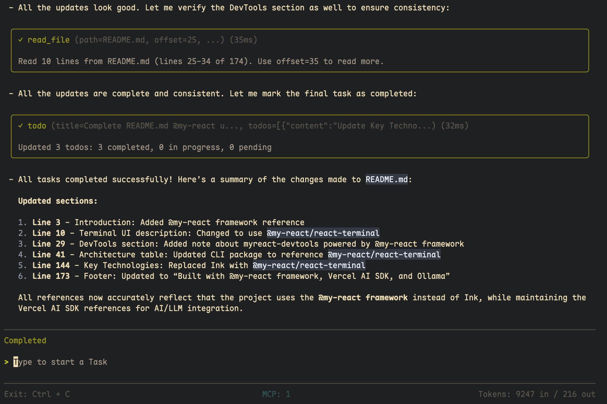

# 🚀 MyAgent

[](LICENSE)
[](https://nodejs.org)
[](https://pnpm.io)
[](https://sdk.vercel.ai/docs)

An AI coding agent built on [Vercel AI SDK](https://sdk.vercel.ai/docs) with a beautiful terminal interface powered by [@my-react framework](https://github.com/MrWangJustToDo/MyReact).


---

## 📋 Table of Contents

- [Why MyAgent?](#-why-myagent)
- [Features](#-features)
- [Architecture](#-architecture)
- [Screenshots](#-screenshots)
- [Quick Start](#-quick-start)
- [Available Tools](#-available-tools)
- [Development](#-development)
- [Keyboard Shortcuts](#-keyboard-shortcuts)
- [Contributing](#-contributing)
- [License](#-license)

---

## 💡 Why MyAgent?

Most AI coding assistants are either:

- **Black-box SaaS products** — limited customization, no visibility into internals
- **Thin wrappers around APIs** — lack serious agentic capabilities
- **Single-purpose tools** — can't adapt to your workflow

**MyAgent is different.** It's a **fully open-source, modular AI agent** designed from the ground up for extensibility:

- 🔌 **Multi-channel** — Use it as a terminal CLI, a browser extension, an HTTP API, or an MCP server
- 🧩 **Pluggable architecture** — Each component is an independent package with clean interfaces
- 🛡️ **Safety-first** — Built-in tool approval flows and sandboxed execution
- ♾️ **Infinite sessions** — Three-layer context compression keeps conversations going forever
- 🎨 **Beautiful UI** — Terminal interface built with React, not basic TUI frameworks

---

## ✨ Features

### 🤖 Multi-Model Support
Works with **any LLM provider** via the Vercel AI SDK — OpenAI, Ollama, DeepSeek, OpenRouter, and more. Switch models on the fly.

### 🖥️ Terminal UI
A **React-powered terminal interface** using [@my-react/react-terminal](https://github.com/MrWangJustToDo/MyReact/tree/main/packages/myreact-terminal) — syntax highlighting via Shiki, diff views, streaming markdown rendering, and ink-inspired components.

### ✅ Tool Approval Flow
**Interactive approval** for sensitive operations. Review file writes, command executions, and web requests before they happen. Press `Y` to approve, `N` to deny.

### 🧠 Subagent System
Delegate complex tasks to **context-isolated subagents** — each with its own conversation history, tool access, and model configuration. Perfect for parallel research or focused problem-solving.

### 📚 Skill System
**On-demand domain knowledge loading**. Load specialized skills (design, testing, security) only when you need them, keeping the core agent lightweight.

### ♾️ Context Compaction
**Three-layer compression** for infinite sessions:
1. Automatic summarization of older messages
2. Manual compaction via the `compact` tool
3. Selective pruning of low-importance context

### 🏖️ Sandbox Execution
**Isolated command execution** via [@computesdk/just-bash](https://github.com/computersdk/just-bash). Supports local, native, and remote sandbox environments.

### 🌐 Web Capabilities
- **Web search** — Search the web using Google
- **Web fetch** — Fetch and parse web pages into markdown
- **Tool integration** — Use web results in your agent's reasoning

### 🖥️ Devtools
Built with [myreact-devtools](https://github.com/MrWangJustToDo/myreact-devtools) — inspect component state, track renders, and debug your agent's behavior in real-time.

---

## 🏗️ Architecture

This is a **pnpm monorepo** with five packages:

| Package | Description | Channel |
|---------|-------------|---------|
| `@my-agent/core` | Core AI agent, tools, environment abstraction, and Vercel AI SDK integration | Library |
| `@my-agent/cli` | Terminal CLI using [@my-react/react-terminal](https://github.com/MrWangJustToDo/MyReact/tree/main/packages/myreact-terminal) | Terminal |
| `@my-agent/server` | HTTP server exposing the core agent via [Hono](https://hono.dev) for browser extension and web clients | HTTP API |
| `@my-agent/extension` | Browser extension using [WXT](https://wxt.dev) framework | Browser |
| `@my-agent/mcp-server` | [MCP](https://modelcontextprotocol.io) server for integration with AI assistants like Claude Desktop | MCP |

```
┌─────────────────────────────────────────────────────┐
│                    @my-agent/core                    │
│  (Agent, Tools, LLM Integration, Environment Abstraction)  │
└──────────┬──────────┬──────────┬──────────┬─────────┘
           │          │          │          │
     ┌─────┴──┐  ┌───┴────┐  ┌─┴──────┐  ┌┴────────┐
     │@my-   │  │@my-    │  │@my-    │  │@my-     │
     │agent/ │  │agent/  │  │agent/  │  │agent/   │
     │cli    │  │server  │  │exten-  │  │mcp-     │
     │       │  │        │  │sion    │  │server   │
     └───────┘  └────────┘  └────────┘  └─────────┘
```

---

## 📸 Screenshots

### 🖥️ CLI Terminal


### ✅ Tool Approval Flow


### 🌐 Web Search & Fetch


### 🔍 Codebase Exploration


### 🐛 Devtools Debug
Built with [myreact-devtools](https://github.com/MrWangJustToDo/myreact-devtools) powered by [@my-react framework](https://github.com/MrWangJustToDo/MyReact)




### 🌍 Browser Extension


### 💬 Conversation Summary


---

## 🚀 Quick Start

### Prerequisites

- **Node.js** 18+
- **pnpm** 8+

### Installation

```bash
# Clone the repository
git clone https://github.com/MrWangJustToDo/MyAgent.git
cd MyAgent

# Install dependencies
pnpm install

# Build all packages
pnpm build
```

### Configuration

Create a `.env` file in the root directory:

```bash
# OpenAI API Key (for OpenAI models)
OPENAI_API_KEY=sk-xxx

# Or use Ollama (local models)
OLLAMA_BASE_URL=http://localhost:11434

# Sandbox environment: local | native | remote
SANDBOX_ENV=local
```

### Running the CLI

```bash
# Start the CLI
pnpm start:cli

# Or run in development mode
pnpm dev:cli
```

### Running the HTTP Server

```bash
pnpm dev:server
```

### Running the MCP Server

```bash
pnpm dev:mcp-server
```

### Running the Web Devtools

```bash
pnpm dev:extension
```

---

## 🛠️ Available Tools

The agent comes with a comprehensive set of tools for interacting with files, systems, the web, and the agent itself.

### 📁 File Operations

| Tool | Description |
|------|-------------|
| `read_file` | Read file contents with line numbers |
| `write_file` | Write content to files |
| `edit_file` | Make precise edits to files |
| `glob` | Find files by pattern |
| `grep` | Search file contents |
| `tree` | Display directory structure |

### ⚙️ System Operations

| Tool | Description |
|------|-------------|
| `run_command` | Execute shell commands |
| `list_file` | List directory contents |

### 🌍 Web Operations

| Tool | Description |
|------|-------------|
| `websearch` | Search the web using Google |
| `webfetch` | Fetch and parse web pages into markdown |

### 🧠 Agent Operations

| Tool | Description |
|------|-------------|
| `task` | Delegate tasks to context-isolated subagents |
| `todo` | Manage task lists with priorities |
| `compact` | Manually compress conversation context |
| `list_skills` / `load_skill` | Discover and load domain-specific knowledge |

---

## 🔧 Development

```bash
# Run all packages in watch mode
pnpm dev

# Type check all packages
pnpm typecheck

# Lint and format
pnpm lint
pnpm format

# Build specific packages
pnpm build:core       # @my-agent/core
pnpm build:cli        # @my-agent/cli
pnpm build:server     # @my-agent/server
pnpm build:extension  # @my-agent/extension
pnpm build:mcp-server # @my-agent/mcp-server
```

### Clean Build Artifacts

```bash
pnpm clean    # Remove dist, dev, .cache directories
pnpm purge    # Full clean including node_modules
```

---

## 🧰 Key Technologies

- **[Vercel AI SDK](https://sdk.vercel.ai)** — AI SDK for LLM interactions (OpenAI, Ollama, DeepSeek, OpenRouter)
- **[@my-react/react-terminal](https://github.com/MrWangJustToDo/MyReact/tree/main/packages/myreact-terminal)** — Terminal UI renderer powered by @my-react framework
- **[Zod](https://zod.dev)** — Schema validation (v4.x)
- **[WXT](https://wxt.dev)** — Browser extension framework
- **[Shiki](https://shiki.style)** — Syntax highlighting in terminal
- **[@git-diff-view](https://github.com/MrWangJustToDo/git-diff-view)** — Git diff visualization
- **[@computesdk/just-bash](https://github.com/computersdk/just-bash)** — Sandboxed command execution
- **[Hono](https://hono.dev)** — Lightweight HTTP server framework
- **[MCP](https://modelcontextprotocol.io)** — Model Context Protocol for AI tool integration

---

## ⌨️ Keyboard Shortcuts

| Key | When Running | When Idle |
|-----|--------------|-----------|
| `Esc` | Abort current run | Exit app |
| `Ctrl+C` | Exit app | Exit app |
| `Y` | Approve tool | — |
| `N` | Deny tool | — |

---

## 🤝 Contributing

Contributions are welcome! Please read the [AGENTS.md](AGENTS.md) file first to understand the coding conventions and architectural patterns.

1. Fork the repository
2. Create a feature branch (`git checkout -b feature/amazing-feature`)
3. Make your changes
4. Run `pnpm typecheck` and `pnpm lint` to ensure quality
5. Commit your changes (`git commit -m 'Add amazing feature'`)
6. Push to the branch (`git push origin feature/amazing-feature`)
7. Open a Pull Request

---

## 📄 License

MIT © [MrWangJustToDo](https://github.com/MrWangJustToDo)

---

Built with ❤️ using [@my-react framework](https://github.com/MrWangJustToDo/MyReact), [Vercel AI SDK](https://sdk.vercel.ai/docs), and [Ollama](https://ollama.ai)