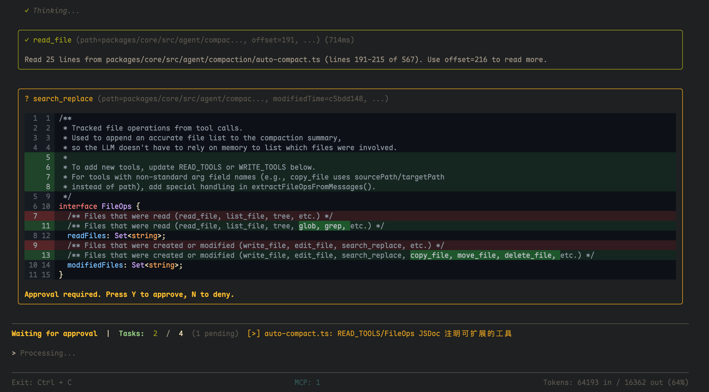

# 🚀 MyAgent

[](LICENSE)
[](https://nodejs.org)
[](https://pnpm.io)
[](https://sdk.vercel.ai/docs)

An open-source AI coding agent built on [Vercel AI SDK](https://sdk.vercel.ai/docs) with a beautiful terminal interface powered by [@my-react framework](https://github.com/MrWangJustToDo/MyReact).


---

## 📋 Table of Contents

- [Why MyAgent?](#-why-myagent)
- [Features](#-features)
- [Architecture](#-architecture)
- [Packages](#-packages)
- [Screenshots](#-screenshots)
- [Quick Start](#-quick-start)
- [Configuration](#-configuration)
- [Available Tools](#-available-tools)
- [HTTP Server API](#-http-server-api)
- [Browser Extension](#-browser-extension)
- [MCP Server](#-mcp-server)
- [Development](#-development)
- [Keyboard Shortcuts](#-keyboard-shortcuts)
- [Key Technologies](#-key-technologies)
- [Contributing](#-contributing)
- [License](#-license)

---

## 💡 Why MyAgent?

Most AI coding assistants are either:

- **Black-box SaaS products** — limited customization, no visibility into internals
- **Thin wrappers around APIs** — lack serious agentic capabilities
- **Single-purpose tools** — can't adapt to your workflow

**MyAgent is different.** It's a **fully open-source, modular AI agent** designed from the ground up for extensibility:

- 🔌 **Multi-channel** — Use it as a terminal CLI, a browser extension, an HTTP API, or an MCP server
- 🧩 **Pluggable architecture** — Each component is an independent package with clean interfaces
- 🛡️ **Safety-first** — Built-in tool approval flows and sandboxed execution
- ♾️ **Infinite sessions** — Three-layer context compression keeps conversations going forever, plus session save/resume
- 🎨 **Beautiful UI** — Terminal interface built with React, not basic TUI frameworks

---

## ✨ Features

### 🤖 Multi-Model Support
Works with **any LLM provider** via the Vercel AI SDK — **OpenAI, Ollama (native), DeepSeek, OpenRouter, and any OpenAI-compatible API** (LMStudio, vLLM, etc.). Switch models on the fly. Ollama models with reasoning capabilities (like Qwen3, DeepSeek-R1) auto-extract thinking tags.

### 🖥️ Terminal UI
A **React-powered terminal interface** using [@my-react/react-terminal](https://github.com/MrWangJustToDo/MyReact/tree/main/packages/myreact-terminal) — syntax highlighting via Shiki, diff views, streaming markdown rendering, input history, and ink-inspired components.

### ✅ Tool Approval Flow
**Interactive approval** for sensitive operations. Review file writes, command executions, and web requests before they happen. Press `y` to approve, `n` to deny.

### 🧠 Subagent System
Delegate complex tasks to **context-isolated subagents** — each with its own conversation history, read-only tools, and a 30-step iteration limit. Perfect for parallel research or focused problem-solving.

### 📚 Skill System
**On-demand domain knowledge loading**. Discover available skills with `list_skills`, load full content with `load_skill` — keeps the core agent lightweight while supporting deep specialization when needed.

### ♾️ Context Compaction
**Three-layer compression** for infinite sessions:
1. **Micro-compaction** (Layer 1) — Automatic replacement of old tool results with placeholders on every LLM call
2. **Auto-compaction** (Layer 2) — Subagent-based summarization when token threshold is exceeded
3. **Compact tool** (Layer 3) — Manual trigger for on-demand compression, with todo preservation

### 📋 Todo Management
Built-in **TodoManager** with priorities, status tracking, and automatic reminder nags. Todos are preserved across context compaction.

### 🏖️ Sandbox Execution
**Isolated command execution** via [@computesdk/just-bash](https://github.com/computersdk/just-bash). Three environment modes:
- `local` — Sandboxed via just-bash (default)
- `native` — Direct system access via real bash and Node.js fs
- `remote` — Cloud execution via computesdk

### 🌐 Web Capabilities
- **Web search** — Search the web using DuckDuckGo (no API key required)
- **Web fetch** — Fetch and parse web pages into markdown, HTML, or plain text
- **Domain filtering** — Allow/block specific domains in searches

### 🔄 Session Persistence
**Full session save/resume** — save conversations to disk and resume them later. Sessions store complete message history with metadata.

### 🔌 MCP Integration
**Model Context Protocol** support — connect to MCP servers for additional tools and capabilities. Load MCP config from JSON files.

### 📝 Structured Logging
Built-in **AgentLog** system with configurable log levels, categories, and filters for debugging agent behavior.

### 📦 Translate Module
Extra utilities via `@my-agent/core/ext` — language detection and translation powered by LLM.

### 🖥️ Devtools
Built with [myreact-devtools](https://github.com/MrWangJustToDo/myreact-devtools) — inspect component state, track renders, and debug your agent's behavior in real-time.

---

## 🏗️ Architecture

This is a **pnpm monorepo** with five packages:

| Package | Description | Channel |
|---------|-------------|---------|
| `@my-agent/core` | Core AI agent, tools, environment abstraction, session management, MCP integration, and Vercel AI SDK integration | Library |
| `@my-agent/cli` | Terminal CLI using [@my-react/react-terminal](https://github.com/MrWangJustToDo/MyReact/tree/main/packages/myreact-terminal) | Terminal |
| `@my-agent/server` | HTTP server exposing the core agent via [Hono](https://hono.dev) for browser extension and web clients | HTTP API |
| `@my-agent/extension` | Browser extension using [WXT](https://wxt.dev) framework, with [@heroui/react](https://heroui.com) UI and React 19 | Browser |
| `@my-agent/mcp-server` | [MCP](https://modelcontextprotocol.io) server for integration with AI assistants like Claude Desktop (includes screenshot tool) | MCP |

```
┌──────────────────────────────────────────────────────────────────┐
│                         @my-agent/core                           │
│  (Agent, Tools, LLM Integration, Environment, Sessions, MCP)     │
└──────┬──────────┬──────────┬──────────────┬──────────┬──────────┘
       │          │          │              │          │
  ┌────┴───┐  ┌──┴────┐  ┌─┴────────┐  ┌──┴─────┐  ┌┴──────────┐
  │@my-    │  │@my-   │  │@my-      │  │@my-    │  │@my-       │
  │agent/  │  │agent/ │  │agent/    │  │agent/  │  │agent/     │
  │cli     │  │server │  │extension │  │mcp-    │  │core/ext   │
  │        │  │       │  │          │  │server  │  │(translate)│
  └────────┘  └───────┘  └──────────┘  └────────┘  └───────────┘
```

---

## 📦 Packages

### @my-agent/core
The heart of the system. Sub-modules include:

| Module | Description |
|--------|-------------|
| `agent/loop` | Main Agent class, tool execution, streaming, approval flows |
| `agent/tools` | 21 tools (file ops, web, system, agent operations) |
| `agent/agent-context` | Conversation state, token usage tracking, context management |
| `agent/subagent` | Context-isolated subagents for delegated tasks |
| `agent/skills` | Two-layer on-demand skill injection (list → load) |
| `agent/compaction` | Three-layer context compression system |
| `agent/session` | Session save/resume with disk persistence |
| `agent/mcp` | MCP (Model Context Protocol) integration |
| `agent/agent-log` | Structured logging system |
| `agent/todo-manager` | Todo list management with priorities |
| `environment` | Sandbox abstraction (local/native/remote) |
| `managers` | AgentManager, SandboxManager, ToolsManager |
| `translate` | Language detection & translation (`@my-agent/core/ext`) |

### @my-agent/cli
Terminal application with React-powered UI:
- Streaming markdown with Shiki syntax highlighting
- Git diff visualization via `@git-diff-view`
- Input history navigation, tab completion
- Tool approval interface
- Todo list display
- Session picker for resuming conversations

### @my-agent/server
HTTP server (Hono) with endpoints:
- `GET /api/health` — Server health and model info
- `POST /api/chat` — Streaming chat completions
- `GET /api/usage` — Token usage statistics
- `POST /api/chat/stop` — Abort current request
- `GET /api/sessions` — List available sessions
- `GET /api/sessions/:id` — Load a specific session
- `POST /api/sessions/:id/resume` — Resume a session
- `POST /api/sessions/messages` — Update UI messages

### @my-agent/extension
Browser extension (Chrome/Edge) using WXT:
- **Side panel** — Full chat interface with message history
- **Popup** — Quick access to agent
- **Background script** — Opens side panel on icon click
- **Devtools panel** — Integrated myreact-devtools for debugging
- Built with @heroui/react, Tailwind CSS v4, framer-motion

### @my-agent/mcp-server
MCP server with screenshot capability:
- `screenshot` — Capture screen shots (resized/compressed to reduce token usage)
- Uses `@cyanheads/mcp-ts-core` framework
- Integrates with Claude Desktop and other MCP-compatible assistants

---

## 📸 Screenshots

### 🖥️ CLI Terminal


### ✅ Tool Approval Flow


### 🌐 Web Search & Fetch


### 🔍 Codebase Exploration


### ✏️ Edit with Diff View


### 🐛 Devtools Debug
Built with [myreact-devtools](https://github.com/MrWangJustToDo/myreact-devtools) powered by [@my-react framework](https://github.com/MrWangJustToDo/MyReact)


### 🌍 Browser Extension


### 💬 Conversation Summary


---

## 🚀 Quick Start

### Prerequisites

- **Node.js** 18+
- **pnpm** 9+

### Installation

```bash
# Clone the repository
git clone https://github.com/MrWangJustToDo/MyAgent.git
cd MyAgent

# Install dependencies
pnpm install

# Build all packages
pnpm build
```

### Configuration

Create a `.env` file in the root directory:

```bash
# LLM Provider Configuration
# Choose one:
PROVIDER=ollama              # ollama | openai | openaiCompatible | openRouter | deepseek
MODEL=qwen3:8b               # or: gpt-4o, deepseek-chat, claude-sonnet-4, etc.
API_URL=http://localhost:11434  # Provider base URL (Ollama default)
API_KEY=sk-xxx               # API key (required for OpenAI, DeepSeek, OpenRouter)

# Server configuration
SERVER_PORT=3100
ROOT_PATH=/path/to/project   # Working directory
MAX_ITERATIONS=50            # Max agent steps per request

# Sandbox environment: local | native | remote
SANDBOX_ENV=local

# Optional: MCP config path
MCP_CONFIG_PATH=./mcp.json
```

### Running the CLI

```bash
# Start the CLI
pnpm start:cli

# Or run in development mode
pnpm dev:cli
```

### Running the HTTP Server

```bash
pnpm dev:server
```

### Running the Browser Extension

```bash
# Development mode (opens browser with hot reload)
pnpm dev:extension

# Build for production
pnpm build:extension
```

### Running the MCP Server

```bash
pnpm dev:mcp-server
```

---

## 🔧 Configuration

### Provider Options

| Provider | `PROVIDER` | `MODEL` example | Requires API Key |
|----------|------------|-----------------|-----------------|
| Ollama | `ollama` | `qwen3:8b`, `llama3`, `deepseek-r1` | No |
| OpenAI | `openai` | `gpt-4o`, `gpt-4o-mini` | Yes |
| OpenAI-compatible | `openaiCompatible` | (any) | Varies |
| OpenRouter | `openRouter` | `anthropic/claude-sonnet-4` | Yes |
| DeepSeek | `deepseek` | `deepseek-chat`, `deepseek-reasoner` | Yes |

### Ollama Reasoning

Ollama models with reasoning capabilities (like Qwen3, DeepSeek-R1) automatically extract `<think>` tags into a separate reasoning display using `extractReasoningMiddleware`.

### Sandbox Environments

| Value | Description | Use Case |
|-------|-------------|----------|
| `local` | (default) Uses just-bash for isolated sandbox execution | Safe development |
| `native` | Direct system access via real bash and Node.js fs | Full control |
| `remote` | Cloud execution via computesdk | Remote development |

---

## 🛠️ Available Tools

The agent comes with **21 tools** organized into categories:

### 📁 File Operations

| Tool | Description |
|------|-------------|
| `read_file` | Read file contents with line numbers, supports offset/limit pagination. Handles text, directories, images, PDFs, and binary files |
| `write_file` | Write content to files, auto-creates directories |
| `edit_file` | Make precise search-and-replace edits to files |
| `search_replace` | Perform multiple search-and-replace operations atomically |
| `copy_file` | Copy a file from source to destination |
| `move_file` | Move or rename a file |
| `delete_file` | Delete files or directories |
| `glob` | Find files matching a glob pattern |
| `grep` | Search file contents using regular expressions |
| `tree` | Display directory structure with depth control |
| `list_file` | List directory contents with pagination |

### ⚙️ System Operations

| Tool | Description |
|------|-------------|
| `run_command` | Execute shell commands with timeout and output limits (50KB max) |
| `list_command` | List available commands in the environment |
| `man_command` | Get manual/help information for a command |

### 🌍 Web Operations

| Tool | Description |
|------|-------------|
| `websearch` | Search the web using DuckDuckGo (no API key). Supports domain filtering, up to 10 results |
| `webfetch` | Fetch and parse web pages into markdown (default), HTML, or plain text. Handles base64 images |

### 🧠 Agent Operations

| Tool | Description |
|------|-------------|
| `task` | Delegate tasks to context-isolated subagents (read-only tools, 30-step limit) |
| `todo` | Manage task lists with priorities, status, and automatic reminders |
| `compact` | Manually compress conversation context with todo preservation |
| `list_skills` | Discover available domain-specific skills |
| `load_skill` | Load full skill content on demand |

### Tool Output Limits

Tools implement built-in truncation to prevent context window overflow:

| Tool | Limit |
|------|-------|
| `read_file` | Max 2000 lines, 100KB content, 2000 chars/line |
| `run_command` | Max 50KB stdout/stderr each (keeps end of output) |
| `grep` | Max 500 chars/line, 50KB total |
| `webfetch` | Max 5MB response, 100KB content (~25k tokens) |

---

## 🌐 HTTP Server API

### Endpoints

| Method | Path | Description |
|--------|------|-------------|
| `GET` | `/api/health` | Server health check, returns model/provider info |
| `POST` | `/api/chat` | Streaming chat completion (Vercel AI SDK UI stream) |
| `GET` | `/api/usage` | Token usage statistics (input, output, total, percent) |
| `POST` | `/api/chat/stop` | Abort the current chat request |
| `GET` | `/api/sessions` | List all saved sessions |
| `GET` | `/api/sessions/:id` | Load a specific session by ID |
| `POST` | `/api/sessions/:id/resume` | Resume a saved session |
| `POST` | `/api/sessions/messages` | Update session UI messages |

### CORS

The server allows requests from:
- `chrome-extension://*` origins
- Localhost and 127.0.0.1 origins
- Same-origin requests

---

## 🌍 Browser Extension

The MyAgent browser extension is built with [WXT](https://wxt.dev) and supports **Chrome** and **Edge**.

### Features
- **Side panel** — Full chat interface with streaming messages, tool calls, and reasoning display
- **Popup** — Quick access interface
- **Auto-open** — Extension icon opens the side panel automatically
- **Devtools** — Integrated myreact-devtools for debugging agent state
- **Connection guard** — Shows connection status to the HTTP server

### Prerequisites
The extension requires the MyAgent HTTP server running locally:

```bash
pnpm dev:server
```

Then build and load the extension:

```bash
pnpm build:extension
# Load the dist/chrome-mv3 directory into Chrome
```

---

## 🧠 MCP Server

The MyAgent MCP server provides tools to AI assistants via the [Model Context Protocol](https://modelcontextprotocol.io).

### Available Tools

| Tool | Description |
|------|-------------|
| `screenshot` | Capture a screenshot of the current screen. Image is resized and compressed to reduce token usage |

### Integration with Claude Desktop

Add to your `claude_desktop_config.json`:

```json
{
  "mcpServers": {
    "my-agent": {
      "command": "node",
      "args": ["path/to/packages/mcp-server/dist/index.mjs"]
    }
  }
}
```

---

## ⌨️ Keyboard Shortcuts

### CLI

| Key | When Running | When Idle |
|-----|--------------|-----------|
| `Esc` | Abort current run | Exit app |
| `Ctrl+C` | Exit app | Exit app |
| `y` | Approve pending tool | — |
| `n` | Deny pending tool | — |
| `↑` / `↓` | — | Navigate input history |
| `Enter` | — | Submit input |

---

## 🧰 Key Technologies

- **[Vercel AI SDK](https://sdk.vercel.ai)** (v6.x) — AI SDK for LLM interactions
- **[@my-react/react-terminal](https://github.com/MrWangJustToDo/MyReact/tree/main/packages/myreact-terminal)** — Terminal UI renderer
- **[@my-react/react](https://github.com/MrWangJustToDo/MyReact)** — React framework (CLI: v0.3.x)
- **[React 19](https://react.dev)** — UI library (Extension)
- **[Zod](https://zod.dev)** (v4.x) — Schema validation
- **[WXT](https://wxt.dev)** — Browser extension framework
- **[@heroui/react](https://heroui.com)** (v2.8) — UI component library (Extension)
- **[Tailwind CSS](https://tailwindcss.com)** (v4.x) — CSS framework (Extension)
- **[framer-motion](https://www.framer.com/motion)** — Animation library (Extension)
- **[lucide-react](https://lucide.dev)** — Icon library (Extension)
- **[Shiki](https://shiki.style)** — Syntax highlighting in terminal
- **[@git-diff-view](https://github.com/MrWangJustToDo/git-diff-view)** — Git diff visualization
- **[@computesdk/just-bash](https://github.com/computersdk/just-bash)** — Sandboxed command execution
- **[@computesdk/provider](https://computesdk.com)** — Remote compute provider
- **[Hono](https://hono.dev)** — Lightweight HTTP server framework
- **[MCP](https://modelcontextprotocol.io)** — Model Context Protocol
- **[@cyanheads/mcp-ts-core](https://github.com/cyanheads/mcp-ts-core)** — MCP server framework
- **[reactivity-store](https://github.com/MrWangJustToDo/reactivity-store)** — State management (Zustand-like API)
- **[stream-markdown-parser](https://github.com/MrWangJustToDo/stream-markdown-parser)** — Streaming markdown parsing
- **[tsdown](https://github.com/MrWangJustToDo/tsdown)** — TypeScript build tool
- **[screenshot-desktop](https://github.com/nicedoc/screenshot-desktop)** — Cross-platform screenshots (MCP server)
- **[sharp](https://sharp.pixelplumbing.com)** — Image processing (MCP server)

---

## 🔧 Development

```bash
# Run all packages in watch mode
pnpm dev

# Type check all packages
pnpm typecheck

# Lint and format
pnpm lint
pnpm format

# Build specific packages
pnpm build:core       # @my-agent/core
pnpm build:cli        # @my-agent/cli
pnpm build:server     # @my-agent/server
pnpm build:extension  # @my-agent/extension (Chrome)
pnpm build:mcp-server # @my-agent/mcp-server
```

### Clean Build Artifacts

```bash
pnpm clean    # Remove dist, dev, .cache directories
pnpm purge    # Full clean including node_modules
```

---

## 🤝 Contributing

Contributions are welcome! Please read the [AGENTS.md](AGENTS.md) file first to understand the coding conventions and architectural patterns.

1. Fork the repository
2. Create a feature branch (`git checkout -b feature/amazing-feature`)
3. Make your changes
4. Run `pnpm typecheck` and `pnpm lint` to ensure quality
5. Commit your changes (`git commit -m 'Add amazing feature'`)
6. Push to the branch (`git push origin feature/amazing-feature`)
7. Open a Pull Request

---

## 📄 License

MIT © [MrWangJustToDo](https://github.com/MrWangJustToDo)

---

Built with ❤️ using [@my-react framework](https://github.com/MrWangJustToDo/MyReact), [Vercel AI SDK](https://sdk.vercel.ai/docs), and [Ollama](https://ollama.ai)
