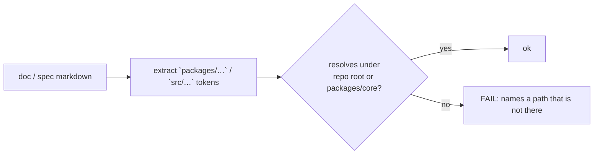

# Design: Align the organization spec with the policy it contradicts

## Context

The requirement being corrected is a **snapshot list**:

```
Each domain utility directory SHALL provide an `index.ts` barrel. The directories in scope
are `src/utils/`, `src/agent/approval/`, `src/agent/media/`, `src/agent/run-helpers/`, and
`src/managers/stream-recovery/`.
```

Everything after "The directories in scope are" is stale. `src/agent/run-helpers/` does not exist;
`src/utils/index.ts`, `src/agent/approval/index.ts`, `src/agent/media/index.ts` and
`src/managers/stream-recovery/index.ts` were all imported by nobody and were removed. What survived
is the first sentence's *intent*, which `AGENTS.md` states better and the code already follows.

## Goals / Non-Goals

**Goals.** Replace a list with a rule. Make both halves of the old text separately checkable, so a
gate — not a reader — notices the next divergence. Keep the `agent/` barrel-free clause intact
(it was the one part that matched reality).

**Non-Goals.** Re-adding barrels. Enforcing "consume 2+ symbols through the directory root" (see
D3). Touching any module's location — that is `middleware-ownership`.

## Decisions

### D1: The requirement states a *relationship*, not a list

A list has two failure modes and both are present here: an entry that is wrong at birth
(`run-helpers/` did not exist when this was written, or was removed without the list following),
and an entry that becomes wrong by deletion. A relationship — *a barrel exists because a consumer
imports its directory* — cannot rot the same way: it is evaluated against the tree every run.

The rewritten requirement therefore says when a barrel is **appropriate** (a directory consumed as
a unit) and what a barrel **without** such a consumer is (dead weight that reads as an API). The
`agent/` namespace clause becomes the stated rationale rather than a competing instruction, which
is the actual relationship between the two sentences in the old text — the second had been written
to excuse the first, and the first was never reconciled with it.

### D2: Two rules, because the old text conflated two questions

The old requirement mixed up "does this barrel have a consumer?" with "does this directory exist?".
They are different failures with different fixes, so they become different requirements:

| Rule | Question | Gate |
|------|----------|------|
| R-a | A barrel that exists is consumed as a directory | `validate:module-organization` rule 2 (already live) |
| R-b | A repository path named by a documentation file or a main spec resolves | `validate:module-organization` rule 4 (new) |

R-b is the one that catches `run-helpers`. It is broader than barrels on purpose: the same drift
already produced a second instance, `AGENTS.md:604` naming
`packages/core/src/models/prompt-cache.ts` for a file that lives at `models/cache/prompt-cache.ts`.
Both are "the document points at a path that is not there", which is one rule.

### D3: Rule 4 checks existence only — deliberately not the barrel-consumption convention

A tempting, stronger rule is "an importer taking 2+ symbols from one directory must use its barrel
root". Measured against the tree it has **81 violations** across 26 directories, because the
convention (`AGENTS.md:361` — "import from the directory root when consuming 2+ symbols") is
aspirational everywhere and enforced nowhere. A gate that fails 81 legitimate sites is a gate that
gets disabled, which is worse than no gate: it makes the *other* rules look negotiable.

Rule 4 stays narrow for that reason. It checks what is binary and what actually broke: does the
path in the document resolve. The convention stays a guideline, and is recorded as such.

### D4: Scope of rule 4 — documentation and specs, not source comments

Sources of path references, measured:

| Source | `src/`-style refs | Stale |
|--------|------------------|-------|
| `AGENTS.md` | 25 | 1 (`models/prompt-cache.ts`) |
| `CLAUDE.md` | 0 | 0 |
| `openspec/specs/**/*.md` | 7 | 1 (`src/agent/run-helpers`) |

Source-code comments are excluded. A comment naming a path (e.g. "see `agent/channel-write.ts`")
documents a *decision* and is read next to the code it describes, often with an intentional
generalisation ("like `runtime-types/middleware-phase.ts` does"), and scanning every comment for
path-shaped tokens produces matches that are prose, not claims. Docs and specs are the artefacts
whose whole job is to be accurate about the tree, they are few (32 refs total), and both known
stale references live in them.



## Risks / Trade-offs

| Risk | Mitigation |
|------|-----------|
| A doc legitimately names a path outside the repo (an example, a future file) | The check only covers paths that *look* in-repo (`packages/…`, `src/…`); a plain word is ignored. Both current violations are genuine |
| Trailing-slash directory refs (`packages/codent/scripts/`) are common | Resolve with the trailing slash stripped, so a directory reference is a valid claim |
| Rule 4 drifts into a maintenance tax as docs grow | The claim is existence, which a move already requires updating; there is no extra obligation, only a machine that reads it |

## Migration

None. Docs and specs already agree with the tree once the two stale references are corrected — one
is corrected by this change (the spec), the other by `middleware-ownership` (the `AGENTS.md`
`prompt-cache.ts` path, which that change touches).

## Validation

- Rule 4 inverted: delete a directory referenced by a doc → gate fails naming the doc and the path;
  restore → gate passes.
- Rule 2 (unchanged) stays green on the current tree.
- `openspec validate align-organization-spec-with-reality --strict`.
