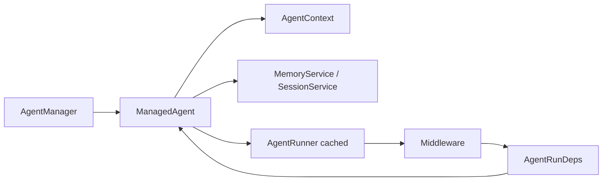

## Context

Current run path:

```
AgentManager.createManagedAgent()
  → new Agent() + new ManagedAgent { agent, context, state, ... }
  → agent.attachManagedState(state)
  → agent.attachManagedAgent(managed)

AgentManager.runAgentStream()
  → run-agent.executeManagedAgentRun()
  → agent.prepareForRun()
  → runStreamWithReactiveCompactRetry()
  → runner.run()  // AgentRunner ~86 lines
  → middleware(compaction, hooks, lifecycle) // 10+ getters from agent
```

**Problem:** `Agent` and `ManagedAgent` both represent "the agent." `Base` still does everything except call `streamText`.

## Target Architecture

```
AgentManager
  └── ManagedAgent (single runtime object)
        ├── id, name, config
        ├── state: { status, error, usage }
        ├── context: AgentContext
        ├── services: { memory, session, todo, log }
        ├── resources: { skills, mcp, hooks, compaction }
        ├── runner?: AgentRunner (cached)
        └── run(input) → AsyncIterable<StreamChunk>

AgentRunner — unchanged: stateless TanStack chat() wrapper
Middleware — receive AgentRunDeps, not () => agent.getX()
```



## Decisions

### 1. Merge Agent + Base into ManagedAgent

**Decision:** Move all substantive logic from `Agent.ts` and `Base.ts` into `ManagedAgent` (or `managed-agent-runtime.ts` if file exceeds 400 lines).

**Moves:**
| From Base/Agent | To |
|-----------------|-----|
| `prepareForRun`, `prepareMessages` | `ManagedAgent.prepareRun()` |
| `getSystemPrompt`, `getDynamicTurnContext` | `ManagedAgent` (or `SystemPromptBuilder` helper) |
| `handleReactiveCompact` | `ManagedAgent` or compaction module |
| `setModelInfo`, compaction config, hooks, MCP, skills | `ManagedAgent` fields + setters used only in `AgentManager.create` |
| Abort controllers | `ManagedAgent` |

**Delete:** `Agent.ts`, `Base.ts`, `agent-loop-host.ts`, `loop/index.ts` exports of `Agent`.

**Rationale:** Design goal was "ManagedAgent owns lifecycle." Keeping `Agent` as a shadow object defeats the purpose.

**Alternative rejected:** Keep `Agent` as internal-only — still two objects, still confusing.

### 2. Replace AgentLoopHost with explicit deps

**Decision:** `MemoryService` and `SessionService` constructors take:

```typescript
interface ServiceDeps {
  getContext: () => AgentContext;
  getLog: () => AgentLog | null;
  resolveTextAdapter: () => Promise<TextAdapterConfig | null>;
  agentId: string;
}
```

`ManagedAgentState` creates services with deps pointing at `ManagedAgent`, not `AgentLoopHost`.

**Rationale:** Removes circular `() => agent` and makes services testable without a god class.

### 3. AgentRunDeps for middleware

**Decision:** Single struct built in `buildAgentRunner(managed)`:

```typescript
interface AgentRunDeps {
  agentId: string;
  context: AgentContext;
  todoManager: TodoManager | null;
  compactionConfig: CompactionConfig | null;
  modelInfo: ModelInfo | null;
  hookRegistry: HookRegistry | null;
  sessionId: string;
  log: AgentLog | null;
  setStatus: (s: AgentStatus) => void;
  getDynamicTurnContext: () => string | undefined;
  shouldAutoCompact: (messages?: ModelMessage[]) => boolean;
}
```

Compaction / hooks / lifecycle middleware accept `AgentRunDeps` instead of 10 separate getters.

**Rationale:** `buildAgentRunner` shrinks; middleware deps are visible in one type.

### 4. Unify run pipeline

**Decision:** Move `runStreamWithReactiveCompactRetry` logic into `ManagedAgent.runStream()` or `runManagedAgent()` in one file. Delete `reactive-compact-retry.ts` as a separate concept — keep `extractRunErrorMessage` in compaction or run module.

**Rationale:** Reactive compact is part of run orchestration, not a third layer.

### 5. Cache AgentRunner

**Decision:** `ManagedAgent` stores `runner` + `runnerGeneration` hash of `(tools keys, textAdapter, config hash)`. Rebuild only on change.

**Fix:** Current `ensureAgentRunner` rebuilds even when `managed.runner` exists — bug to fix.

### 6. Public API: AgentHandle facade (staged)

**Decision:** Phase A keeps exporting name `Agent` as **type alias** `export type Agent = ManagedAgent` for one release. Phase B renames app imports to `ManagedAgent`.

**Rationale:** 12 app files import `Agent`; alias avoids big-bang app change. Facade methods (`getContext()`, `getSessionStore()`, etc.) remain on `ManagedAgent`.

**Alternative:** Break app in same PR — higher risk, faster cleanup.

### 7. bridgeUI

**Decision:** Keep `bridgeUI` option but implement inside `ManagedAgent.run()` — not a separate code path in `run-agent.ts`. Long-term: only subagent uses `AgentUIChannel`; main chat uses `useChat` only.

### 8. File layout after convergence

```
packages/core/src/managers/
  manager-agent.ts      # factory, registry, spawn, approve (~350 lines target)
  managed-agent.ts      # type + timestamps
  managed-agent-runtime.ts  # NEW: run, prepare, system prompt, reactive compact
  managed-agent-state.ts
  run-agent.ts          # buildAgentRunner, resolveTextAdapter (slim)
  agent-ui-channel.ts
  usage-tracker.ts

packages/core/src/agent/
  runner/               # AgentRunner only
  middleware/           # deps via AgentRunDeps
  loop/                 # DELETE entire folder except types moved to managers/
```

Move `AgentConfig`, `AgentStatus`, `AgentRunOptions` from `loop/types.ts` → `managers/agent-types.ts`.

## Migration Phases

### Phase A — Internal merge (core only, no app breakage)

1. Create `managed-agent-runtime.ts` with logic copied from `Base`/`Agent`
2. Switch `MemoryService` / `SessionService` to `ServiceDeps`
3. `ManagedAgent` implements all methods; `agent` field becomes optional shim
4. `export type Agent = ManagedAgent` + delegate `createManagedAgent` return type

### Phase B — Delete legacy classes

1. Remove `Agent` class instantiation — `createManagedAgent` builds `ManagedAgent` directly
2. Delete `Base.ts`, `Agent.ts`, `agent-loop-host.ts`
3. Introduce `AgentRunDeps`; slim middleware factories
4. Merge `reactive-compact-retry` into run path; fix runner cache

### Phase C — App type cleanup

1. Rename `Agent` → `ManagedAgent` in app/cli/extension
2. Remove type alias from core exports
3. Update `AGENTS.md` architecture section

## Risks

| Risk | Mitigation |
|------|------------|
| Large single file | Split `managed-agent-runtime.ts` + `system-prompt.ts` at 400 lines |
| App slash commands use `agent.getX()` | Keep methods on `ManagedAgent`; alias type |
| Subagent spawn path | Test `task` tool + `spawnSubagent` after Phase A |
| `/compact` sets `agent.status` | `ManagedAgent.status` setter already proxies to state |

## Metrics (before → after target)

| File / area | Before | Target |
|-------------|--------|--------|
| `Base.ts` + `Agent.ts` | ~690 | 0 (deleted) |
| `manager-agent.ts` | ~590 | ~350 |
| `run-agent.ts` + `reactive-compact-retry.ts` | ~330 | ~150 |
| `AgentLoopHost` | 1 interface | 0 |
| Concepts per agent | 4 (Agent, Base, State, Managed) | 2 (ManagedAgent, State) |
